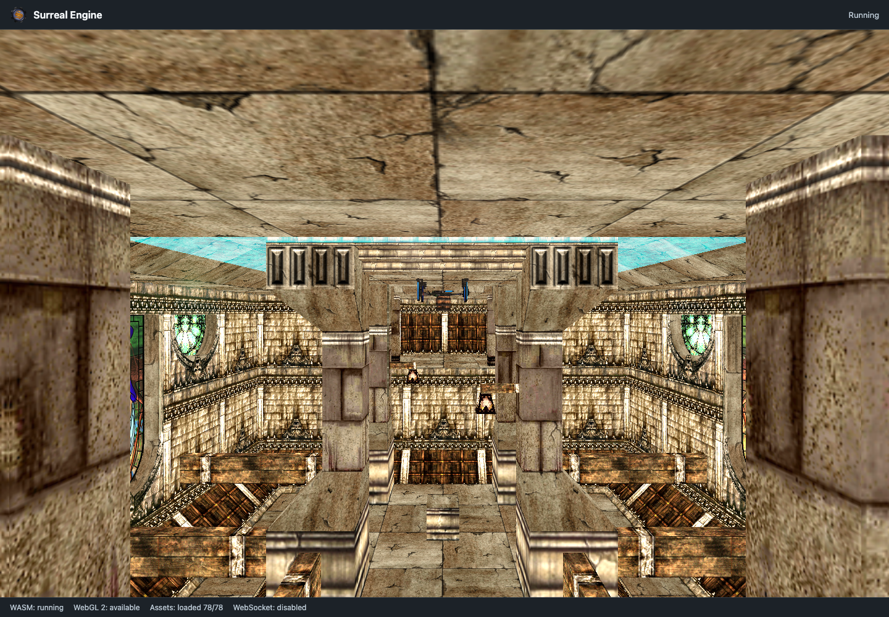
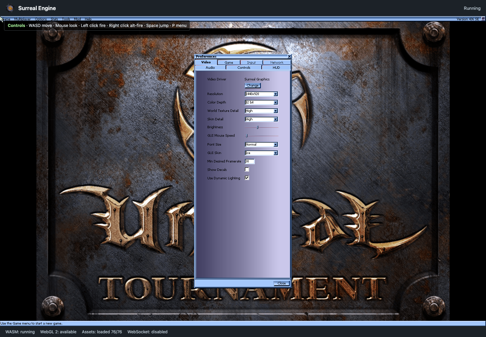

# Surreal Tournament for Forge

This Forge Custom UI hosts the browser port of Surreal Engine and boots the
UT99 v436 runtime in a WebGL 2 canvas. It mounts a bounded UT99 asset bundle,
starts the UnrealScript game loop, accepts keyboard and mouse input, and
renders the DM-Tutorial map. The target is a reliable single-player bootstrap
that runs inside Jira and from a static local server.





The current build includes:

- Emscripten WASM engine with UnrealScript VM and WebGL 2 renderer
- Browser input, pointer lock, and OpenAL-compatible audio setup
- 78 gzip-compressed UT99 startup files under `/ut`
- DM-Tutorial map and its recursive package dependencies
- Standard WASD movement, mouse look, fire, alternate fire, jump, and Escape help menu
- In-canvas asset and WASM diagnostics during startup

The complete UT99 installation, optional maps, and multiplayer networking are
not bundled. The current game target is the local DM-Tutorial session.

## Build and run locally

Prerequisites are Node 22+, npm, CMake, Ninja, Emscripten, and the Forge CLI.

```bash
cd forge-jira
npm ci
npm --prefix static/surreal ci
npm run build:all
npx serve static/surreal/dist -l 3000
```

Open `http://localhost:3000`, wait for all assets to mount, and click **Play**.
The canvas should show the tutorial map and the status bar should report
`WASM: running` and `Assets: loaded 78/78`.

The production payload is the exact `static/surreal/dist` directory. `build:ui`
checks that it remains below Forge’s 100,000,000-byte static resource limit.

## Controls

`W A S D` moves, the mouse looks, left click fires, right click uses alternate
fire, and Space jumps. Escape opens the browser help menu; Resume returns to the
game. The UnrealScript menu command is retained, but full UT99 setup/options UI
is not yet exposed in the browser shell.

## Verification

```bash
npm test
npm run build:all
npm run test:wasm
forge lint
```

The tests cover asset staging, resolver safety, mount ordering, fetch failures,
and WASM startup errors. The local static run is the renderer and input smoke
test. Forge lint requires an authenticated Forge CLI.

## Assets

Place an installed UT99 directory in the staging workflow, or use the already
staged files under `asset-staging/ut99`:

```bash
npm run assets:stage -- /path/to/UT99 ./asset-staging/ut99
npm run assets:bundle
```

The launch bundle contains the UT99 system packages and configuration, the
`Entry.unr` and `DM-Tutorial.unr` maps, required texture packages, player and
ladder sounds, and the two startup music packages. Files are gzip-compressed
and mounted at `/ut` before `main` is called.

Game files are intentionally ignored by Git. The Forge resource carries the
bounded launch bundle generated from the staging directory.

## Forge deployment

The app uses Custom UI and a read-only resolver for public runtime configuration.
It does not call Jira product APIs or use storage. The browser build requires
the manifest’s documented `unsafe-eval` content permission for WASM compilation.

```bash
forge deploy --environment development
forge install --environment development \
  --site YOUR_SITE.atlassian.net --product Jira --upgrade
```

Deploy the freshly built `static/surreal/dist` contents. After a deployment,
hard-refresh the Custom UI to avoid cached hashed JavaScript or WASM files.

## Current boundaries

This port is focused on bootstrapping UT99 in a Forge-hosted browser canvas.
The renderer currently supports the formats needed by the launch map and uses a
white fallback for unsupported HDR lightmap formats. Full UT99 menu/setup
screens, dynamic package streaming for arbitrary maps, and multiplayer remain
follow-up work.
